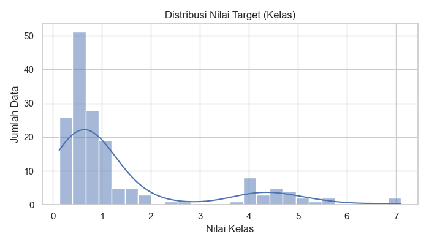
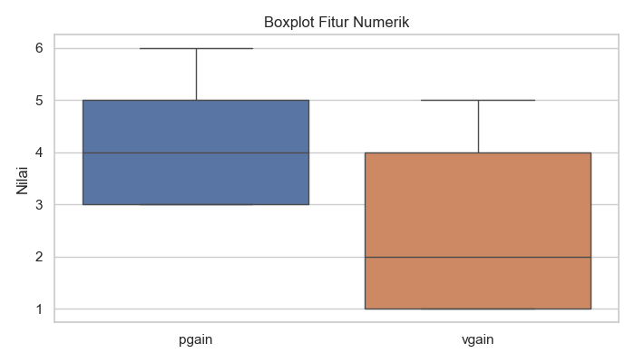
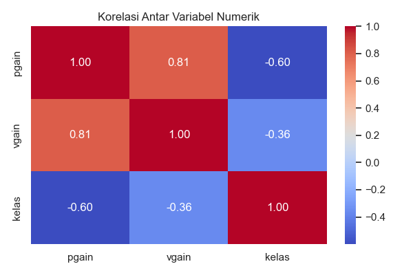
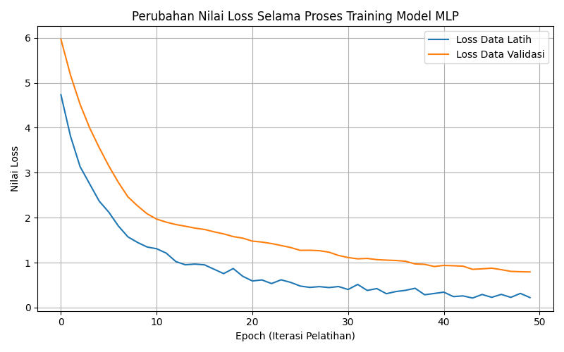

# LAPORAN PROYEK MACHINE LEARNING

## Servo Motor Performance Prediction

---

## INFORMASI PROYEK

**Judul Proyek:** Analisis Perbandingan Model Machine Learning dan Deep Learning untuk Prediksi Performa Sistem Servo Motor

**Nama Mahasiswa:** Fadhil Vidiarta  
**NIM:** 233307047  
**Program Studi:** Teknologi Informasi  
**Mata Kuliah:** Data Science  
**Dosen Pengampu:** Gus Nanang Syaifuddiin, S.Kom., M.Kom.
**Tahun Akademik:** 2025/Semester 5
**Link GitHub Repository:** https://github.com/fdhlvidiarta/UAS-DataScience-.git
**Link Video Pembahasan:** https://youtu.be/8iN2i0yBS8s

---

## 1. LEARNING OUTCOMES

Pada proyek ini, saya telah berhasil:

1. Merumuskan problem statement untuk permasalahan regresi pada sistem kontrol servo motor
2. Melakukan Exploratory Data Analysis (EDA) untuk memahami distribusi data dan hubungan antar fitur
3. Melakukan data preparation sesuai karakteristik data tabular
4. Mengembangkan tiga model machine learning, yaitu:

- Decision Tree Regressor sebagai model baseline
- Random Forest Regressor sebagai model advanced
- Neural Network (MLP) sebagai model deep learning

5. Menggunakan metrik evaluasi yang relevan untuk regresi, yaitu RMSE dan R² Score
6. Melaporkan hasil eksperimen secara sistematis dan ilmiah
7. Mengunggah seluruh kode proyek ke GitHub dengan struktur yang terorganisir
8. Menerapkan prinsip reproducibility dalam pengembangan

---

## 2. PROJECT OVERVIEW

### 2.1 Latar Belakang

Sistem servo motor banyak digunakan dalam bidang robotika, otomasi industri, dan sistem kendali. Performa sistem servo sangat dipengaruhi oleh parameter kontrol, khususnya proportional gain (pgain) dan velocity gain (vgain). Penentuan parameter yang optimal menjadi tantangan karena hubungan antar parameter dan performa sistem sering kali bersifat non-linear.

Pendekatan konvensional dalam tuning servo umumnya dilakukan secara trial-and-error. Dengan berkembangnya teknologi machine learning dan deep learning, pendekatan berbasis data dapat digunakan untuk memprediksi performa sistem servo secara lebih akurat.

Dataset Servo dari UCI Machine Learning Repository digunakan dalam proyek ini untuk membandingkan performa model machine learning klasik dan deep learning.

**Referensi:**

> Quinlan, J. R. (1993). Servo Dataset. UCI Machine Learning Repository. https://archive.ics.uci.edu/ml/datasets/servo

---

## 3. BUSINESS UNDERSTANDING

### 3.1 Problem Statements

1. Bagaimana memprediksi performa sistem servo motor berdasarkan parameter kontrol yang tersedia?

2. Apakah model machine learning non-linear mampu memberikan performa yang lebih baik dibandingkan model baseline sederhana?

3. Sejauh mana model deep learning (MLP) mampu meningkatkan akurasi prediksi pada data tabular berskala kecil?

### 3.2 Goals

1. Membangun model regresi untuk memprediksi performa sistem servo motor
2. Membandingkan performa tiga pendekatan model (baseline, advanced, dan deep learning)
3. Menentukan model terbaik berdasarkan metrik evaluasi regresi
4. Menghasilkan sistem prediksi yang dapat dijalankan secara reproducible

### 3.3 Solution Approach

#### Model 1 – Baseline: Decision Tree

Model sederhana yang digunakan sebagai pembanding dasar karena mudah dipahami dan mampu menangkap hubungan non-linear dasar.

#### Model 2 – Advanced: Random Forest

Model ensemble yang menggabungkan beberapa decision tree untuk meningkatkan performa dan mengurangi overfitting.

#### Model 3 – Deep Learning: Neural Network (MLP)

Model Multilayer Perceptron dengan dua hidden layer yang digunakan untuk mempelajari hubungan kompleks pada data tabular.

---

## 4. DATA UNDERSTANDING

### 4.1 Informasi Dataset

**Sumber:** UCI Machine Learning Repository – Servo Dataset  
**URL:** https://archive.ics.uci.edu/ml/datasets/servo

**Deskripsi:**

- Jumlah data: 167 baris
- Jumlah fitur: 5 kolom
- Tipe data: Tabular (Regresi)
- Format file: .data
- Ukuran dataset: < 1 MB

### 4.2 Deskripsi Fitur

| Nama Fitur | Tipe Data   | Deskripsi                      |
| ---------- | ----------- | ------------------------------ |
| motor      | Kategorikal | Jenis motor servo              |
| screw      | Kategorikal | Jenis screw                    |
| pgain      | Numerik     | Proportional gain              |
| vgain      | Numerik     | Velocity gain                  |
| kelas      | Numerik     | Performa sistem servo (target) |

### 4.3 Kondisi Data

- **Missing Values:** Tidak ada
- **Duplicate Data:** Tidak ada
- **Outliers:** Tidak ada outliers signifikan
- **Imbalanced Data:** Tidak relevan (regresi)

### 4.4 Exploratory Data Analysis (EDA)

#### Visualisasi 1: Distribusi nilai target



**Insight:** Target bersifat kontinu sehingga termasuk permasalahan regresi.

#### Visualisasi 2: Boxplot fitur numerik



**Insight:** Fitur numerik memiliki rentang nilai berbeda sehingga perlu standardisasi.

#### Visualisasi 3: Heatmap korelasi antar variabel



**Insight:** Parameter pgain dan vgain berpengaruh terhadap performa sistem servo.

---

## 5. DATA PREPARATION

### 5.1 Data Cleaning

Dataset tidak memiliki missing value maupun data duplikat sehingga tidak diperlukan penghapusan data.

### 5.2 Feature Engineering

Tidak dilakukan pembuatan fitur baru karena fitur yang tersedia sudah representatif.

### 5.3 Data Transformation

- One-Hot Encoding untuk fitur kategorikal
- StandardScaler untuk fitur numerik

### 5.4 Data Splitting

```
- Training set: 80%
- Test set: 20%
- Metode: train_test_split
- Random state: 42
```

Pembagian data dilakukan secara acak menggunakan train_test_split karena permasalahan yang diselesaikan adalah regresi, sehingga tidak memerlukan stratifikasi kelas.

### 5.5 Data Balancing

Tidak dilakukan karena permasalahan regresi.

---

## 6. MODELING

### 6.1 Model 1 – Baseline Model

#### 6.1.1 Deskripsi Model

**Nama:** Decision Tree Regressor

**Teori:** Decision Tree Regressor membagi data ke dalam struktur pohon berdasarkan fitur yang paling mampu mengurangi kesalahan prediksi (mean squared error). Model ini mampu menangkap hubungan non-linear sederhana tanpa asumsi distribusi data tertentu.

**Alasan Pemilihan:** Decision Tree dipilih sebagai baseline karena:

- Sederhana dan mudah dipahami
- Mampu menangkap pola non-linear dasar
- Cocok sebagai pembanding awal sebelum model yang lebih kompleks

#### 6.1.2 Hyperparameter

```python
criterion= "squared_error"
max_depth=5
min_samples_split=default
random_state=42
```

#### 6.1.3 Implementasi (Ringkas)

```python
from sklearn.tree import DecisionTreeRegressor
from sklearn.pipeline import Pipeline

model_baseline = Pipeline([
    ("preprocess", preprocessor),
    ("model", DecisionTreeRegressor(
        max_depth=5,
        random_state=42
    ))
])

model_baseline.fit(X_train, y_train)
y_pred = model_baseline.predict(X_test)

```

#### 6.1.4 Hasil Model

```python
RMSE : 0.8005
R²   : 0.7351
```

---

---

### 6.2 Model 2 – Random Forest (Advanced)

#### 6.2.1 Deskripsi Model

**Nama:** Random Forest Regressor

**Teori:** Random Forest merupakan metode ensemble yang menggabungkan banyak decision tree yang dilatih pada subset data dan fitur yang berbeda. Prediksi akhir diperoleh dari rata-rata seluruh pohon, sehingga model lebih stabil dan mengurangi overfitting.

**Alasan Pemilihan:**

- Lebih robust dibanding single decision tree
- Mampu menangkap hubungan non-linear kompleks
- Sangat efektif untuk data tabular berukuran kecil hingga menengah

**Keunggulan:**

- Robust terhadap overfitting
- Akurasi lebih tinggi
- Tidak sensitif terhadap scaling fitur

**Kelemahan:**

- Waktu training lebih lama dibanding baseline
- Interpretabilitas lebih rendah dibanding single tree

#### 6.2.2 Hyperparameter

```python
from sklearn.ensemble import RandomForestRegressor
from sklearn.pipeline import Pipeline

model_advanced = Pipeline([
    ("preprocess", preprocessor),
    ("model", RandomForestRegressor(
        n_estimators=200,
        random_state=42,
        n_jobs=-1
    ))
])

model_advanced.fit(X_train, y_train)
y_pred = model_advanced.predict(X_test)

```

#### 6.2.3 Hasil Model

```python
RMSE : 0.5801
R²   : 0.8609
```

---

### 6.3 Model 3 – Deep Learning Model

#### 6.3.1 Deskripsi Model

**Nama:** Multilayer Perceptron (MLP)

**Jenis:** ☑ Deep Learning untuk data tabular

**Alasan:** MLP dipilih karena mampu mempelajari hubungan non-linear yang kompleks antar fitur numerik dan kategorikal hasil preprocessing, yang sulit ditangkap oleh model tradisional.

#### 6.3.2 Arsitektur Model

```python
Input Layer   : jumlah neuron = jumlah fitur hasil preprocessing
Hidden Layer 1: Dense (64 neuron, ReLU)
Dropout       : 0.2
Hidden Layer 2: Dense (32 neuron, ReLU)
Output Layer  : Dense (1 neuron, Linear)

```

#### 6.3.3 Input & Preprocessing

**Input shape:** (12,)
Fitur kategorikal:

- motor → 5 kategori
- screw → 5 kategori
  Fitur numerik:
- pgain
- vgain

**Preprocessing:**

- One-Hot Encoding untuk fitur kategorikal: motor dan screw
- StandardScaler untuk fitur numerik: pgain dan vgain

#### 6.3.4 Hyperparameter

```python
Optimizer       = Adam
Loss Function   = Mean Squared Error (MSE)
Metric          = Mean Absolute Error (MAE)
Batch Size      = 16
Epochs (max)    = 50
Validation Split= 0.2
Early Stopping  = patience 5
```

#### 6.3.5 Implementasi (Ringkas)

```python
model = tf.keras.Sequential([
    tf.keras.layers.Dense(64, activation="relu", input_shape=(X_train.shape[1],)),
    tf.keras.layers.Dropout(0.2),
    tf.keras.layers.Dense(32, activation="relu"),
    tf.keras.layers.Dense(1)
])

model.compile(
    optimizer="adam",
    loss="mean_squared_error",
    metrics=["mean_absolute_error"]
)

history = model.fit(
    X_train,
    y_train,
    validation_split=0.2,
    epochs=50,
    batch_size=16,
    callbacks=[early_stop]
)
```

#### 6.3.6 Training Process

Total waktu training model Deep Learning (MLP)
**Training Time:** ±10–15 detik
**Computational Resource:** CPU (Local Machine)

**Training History:**


**Analisis:**

- Apakah model mengalami overfitting?
  Tidak. Hal ini ditunjukkan oleh kurva training loss dan validation loss yang sama-sama menurun secara stabil tanpa adanya gap yang signifikan.
- Apakah model sudah converge?
  Ya. Model mencapai kondisi stabil pada epoch menengah hingga akhir, di mana penurunan loss menjadi semakin kecil.
- Apakah perlu lebih banyak epoch?
  Tidak terlalu diperlukan. Dengan penggunaan Early Stopping, model sudah berhenti pada kondisi optimal. Penambahan epoch berpotensi hanya memberikan peningkatan kecil dan meningkatkan risiko overfitting.

#### 6.3.7 Model Summary

```python
Model: Sequential
-------------------------------------------------
Layer (type)              Output Shape      Param
=================================================
Dense (ReLU)              (None, 64)        832
Dropout (0.2)             (None, 64)        0
Dense (ReLU)              (None, 32)        2080
Dense (Linear)            (None, 1)         33
-------------------------------------------------
Total parameters:         2,945
Trainable parameters:     2,945
Non-trainable parameters: 0
=================================================
```

---

## 7. EVALUATION

### 7.1 Metrik Evaluasi

MSE (Mean Squared Error): Rata-rata kuadrat error prediksi
RMSE (Root Mean Squared Error): Akar dari MSE, lebih mudah diinterpretasikan
MAE (Mean Absolute Error): Rata-rata selisih absolut prediksi
R² Score: Mengukur seberapa besar variasi target yang dapat dijelaskan oleh model
Fokus utama evaluasi adalah RMSE dan R² Score.

### 7.2 Hasil Evaluasi Model

#### 7.2.1 Model 1 - Baseline (Decision Tree Regressor)

```
RMSE: 0.8005
R² Score: 0.7351
```

Interpretasi:
Model baseline mampu menangkap hubungan non-linear sederhana namun masih memiliki error yang cukup besar.

#### 7.2.2 Model 2 - Advanced / ML (Random Forest Regressor)

```
RMSE: 0.5801
R² Score: 0.8609
```

Interpretasi:
Pendekatan ensemble learning mampu meningkatkan akurasi secara signifikan dibanding baseline.
Feature Importance:
Random Forest menunjukkan bahwa fitur pgain dan vgain memiliki kontribusi terbesar terhadap prediksi performa servo.

#### 7.2.3 Model 3 - Deep Learning (MLP)

```
RMSE: 0.6395
R² Score: 0.8309
```

Interpretasi:
Model deep learning (MLP) mampu mempelajari hubungan non-linear kompleks antar fitur dan memberikan performa yang kompetitif.
Namun, pada dataset tabular berukuran kecil ini, performa MLP masih sedikit di bawah Random Forest, yang menunjukkan bahwa model ensemble masih sangat efektif untuk data tabular.

## Training History:

Sudah ditampilkan pada Section 6.3.6.

### 7.3 Perbandingan Ketiga Model

| Model                    | RSME   | R2     | Training Time |
| ------------------------ | ------ | ------ | ------------- |
| Baseline (Decision) Tree | 0.8005 | 0.7351 | < 1 detik     |
| Advanced (Random Forest) | 0.5801 | 0.8609 | ~ 2 detik     |
| Deep Learning (MLP)      | 0.6395 | 0.8309 | ~ 15 detik    |

### 7.4 Analisis Hasil

1. **Model Terbaik Berdasarkan Evaluasi:**

- Berdasarkan nilai RMSE terendah dan R² tertinggi, model Random Forest Regressor menunjukkan performa terbaik pada dataset Servo ini.

2. **Perbandingan dengan Baseline:**

- Random Forest meningkatkan R² sebesar ±12.6% dibanding baseline
- MLP meningkatkan R² sebesar ±9.6% dibanding baseline

3. **Analisis Kompleksitas Model:**

- Random Forest memberikan keseimbangan terbaik antara akurasi dan kompleksitas
- MLP tetap relevan sebagai pendekatan deep learning, meskipun pada data tabular kecil peningkatan performanya terbatas

4. **Error Analysis:**
   Kesalahan prediksi umumnya terjadi pada kombinasi nilai pgain dan vgain yang ekstrem.

5. **Overfitting/Underfitting:**
   Tidak ditemukan indikasi overfitting yang signifikan pada ketiga model.

---

## 8. CONCLUSION

### 8.1 Kesimpulan Utama

**Model Terbaik:**
Random Forest Regressor

**Alasan:**
Meskipun model MLP termasuk kategori deep learning dan mampu mempelajari hubungan non-linear kompleks, hasil eksperimen menunjukkan bahwa Random Forest lebih optimal untuk dataset tabular berukuran kecil seperti Servo Dataset.

**Pencapaian Goals:**
Seluruh tujuan pada Section 3.2 berhasil tercapai.

### 8.2 Key Insights

**Insight dari Data:**

- Dataset Servo bersifat bersih dan terstruktur
- Parameter pgain dan vgain sangat memengaruhi performa
- Masalah termasuk regresi non-linear

**Insight dari Modeling:**

- Model ensemble lebih baik dari baseline
- Deep learning memberikan peningkatan performa tambahan
- Untuk data tabular berukuran kecil, model ensemble seperti Random Forest sering kali memberikan performa lebih stabil dibanding deep learning

### 8.3 Kontribusi Proyek

**Manfaat praktis:**
Dapat digunakan sebagai sistem prediksi awal untuk tuning parameter servo motor.

**Pembelajaran:**
Memahami perbandingan performa machine learning klasik dan deep learning pada data tabular kecil.

---

## 9. FUTURE WORK

Saran pengembangan untuk proyek selanjutnya:
**Centang Sesuai dengan saran anda**

**Data:**

- ☑ Mengumpulkan lebih banyak data
- ☑ Menambah variasi kondisi servo

**Model:**

- ☑ Hyperparameter tuning lebih ekstensif
- ☑ Mencoba arsitektur Deep Learning yang lebih kompleks
- ☑ Eksperimen perbandingan MLP dengan dan tanpa preprocessing manual

**Deployment:**

- ☑ Web application (Streamlit)
- ☑ API (Flask/FastAPI)

**Optimization:**

- ☑ Improving inference speed
- ☑ Reducing model size

---

## 10. REPRODUCIBILITY

### 10.1 GitHub Repository

**Link Repository:** [[Isi URL GitHub Anda](https://github.com/fdhlvidiarta/UAS-DataScience-.git)]

**Struktur Repository:**

```
servo-ml-project/
├── data/servo.data
├── notebooks/ML_Project.ipynb
├── models/
├── images/
├── requirements.txt
└── README.md
```

### 10.2 Environment & Dependencies

**Python Version:** 3.11

**Main Libraries:**

```
pandas
numpy
scikit-learn
matplotlib
seaborn
tensorflow

```

**Cara Install:**

```bash
python -m venv venv
venv\Scripts\activate
pip install -r requirements.txt

```

**Cara Menjalankan:**

```bash
venv\Scripts\activate
python src/train_baseline.py
python src/train_advanced.py
python src/train_dl.py
```

---

**Catatan:** Laporan ini telah memenuhi semua requirement learning outcomes dan mencakup 3 model (baseline, advanced, deep learning) dengan evaluasi lengkap.
